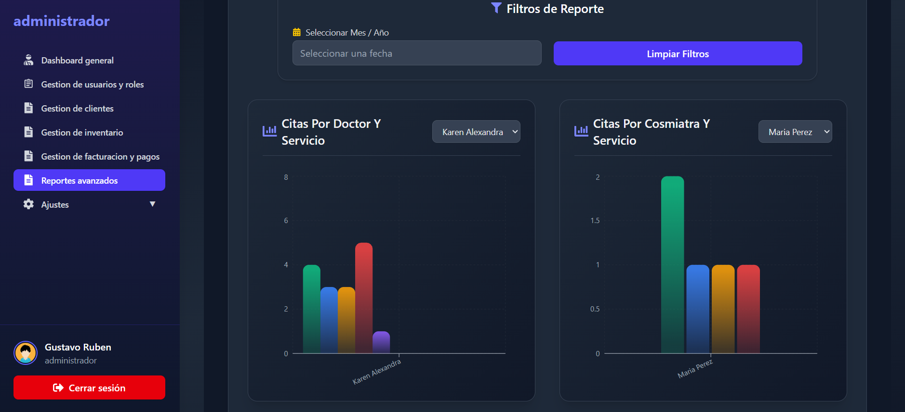

# 💅 Web Karito Centro Estético — ERP para Centros de Estética

Aplicación **ERP (Enterprise Resource Planning)** desarrollada para la **gestión integral de un centro estético**.
Permite administrar clientes, servicios, empleados, citas, inventarios, reportes y más, desde una interfaz moderna, rápida y escalable.

---

## 📷 Captura



---

## 🚀 Características principales

- 👩‍🔧 **Gestión de clientes y empleados**

  Crear, editar y administrar información personal y de contacto.

- 📅 **Módulo de citas**

  Programación, cancelación y recordatorios de citas.

- 💆‍♀️ **Gestión de servicios**

  Control de tratamientos estéticos, precios y duración.

- 📦 **Inventario de productos**

  Registro de insumos, stock, y proveedores.

- 📊 **Panel administrativo y reportes**

  Visualización de métricas clave mediante gráficos dinámicos (Recharts).

- 💬 **Comunicación en tiempo real**

  Implementación de notificaciones y actualizaciones con **Socket.IO**.

- 🧭 **Navegación moderna**

  Sistema de rutas con **React Router DOM v7**.

- 🧠 **Arquitectura modular y escalable**

  Separación por capas y componentes reutilizables.

---

## 🧩 Tecnologías utilizadas

| Tipo                 | Tecnología                            | Descripción                                           |
| -------------------- | ------------------------------------- | ----------------------------------------------------- |
| Frontend             | **React 19 + Vite**                   | Framework moderno y rápido basado en componentes      |
| Estilos              | **TailwindCSS 4**                     | Framework CSS para diseño responsivo y limpio         |
| Ruteo                | **React Router DOM 7**                | Gestión de rutas SPA                                  |
| HTTP Client          | **Axios**                             | Consumo de API REST del backend                       |
| Estado y tiempo real | **Socket.IO Client**                  | Conexión bidireccional en tiempo real                 |
| UI Components        | **React Icons**, **React Datepicker** | Iconografía y selección de fechas                     |
| Gráficos             | **Recharts**                          | Visualización de datos analíticos                     |
| PWA                  | **vite-plugin-pwa**                   | Soporte de aplicación progresiva (offline/instalable) |
| Linter               | **ESLint**                            | Estándares de código y calidad                        |

---

## 🏗️ Arquitectura del proyecto

La aplicación sigue una arquitectura **modular por capas**, inspirada en buenas prácticas de **Clean Architecture** y **Atomic Design** para el frontend:

```
src/
├── assets/              # Imágenes, íconos y recursos estáticos
├── components/          # Componentes reutilizables (botones, inputs, modales)
├── features/            # Módulos funcionales (clientes, citas, servicios, etc.)
├── hooks/               # Custom hooks reutilizables
├── pages/               # Páginas del sistema (Dashboard, Login, Configuración)
├── routes/              # Definición de rutas con React Router
├── services/            # Lógica de conexión a APIs (Axios)
├── context/             # Contextos globales (auth, theme, etc.)
├── utils/               # Funciones y helpers genéricos
├── styles/              # Archivos CSS o Tailwind config
└── main.jsx             # Punto de entrada principal
```

### 🔄 Comunicación con el backend

- La app se conecta a una **API REST desarrollada en Node.js + Express + MongoDB**.
- La autenticación se maneja mediante **JWT (JSON Web Tokens)**.
- La comunicación en tiempo real se implementa con **Socket.IO**.

---

## ⚙️ Instalación y ejecución

### 1️⃣ Clonar el repositorio

```bash
git clone https://github.com/tuusuario/web-estetico.git
cd web-estetico
```

### 2️⃣ Instalar dependencias

```bash
npm install
```

### 3️⃣ Ejecutar en entorno de desarrollo

```bash
npm run dev
```

Por defecto, la app correrá en:

👉 `http://localhost:5173`

### 4️⃣ Generar build de producción

```bash
npm run build
```

### 5️⃣ Previsualizar build

```bash
npm run preview
```

---

## 🔐 Variables de entorno

Crea un archivo `.env` en la raíz con los siguientes valores:

```
VITE_API_URL=http://localhost:4000/api
VITE_SOCKET_URL=http://localhost:4000
```

> ⚠️ No compartas tus credenciales ni tokens en repositorios públicos.

---

## 🧰 Scripts disponibles

| Comando           | Descripción                         |
| ----------------- | ----------------------------------- |
| `npm run dev`     | Inicia el servidor de desarrollo    |
| `npm run build`   | Compila el proyecto para producción |
| `npm run preview` | Ejecuta el build localmente         |
| `npm run lint`    | Revisa errores de estilo y código   |

---

## 📁 Estructura de carpetas (ejemplo visual)

```plaintext
web-estetico/
│
├── public/                 # Archivos públicos
├── src/
│   ├── assets/
│   ├── components/
│   ├── features/
│   ├── pages/
│   ├── services/
│   ├── routes/
│   ├── context/
│   ├── utils/
│   └── main.jsx
│
├── .gitignore
├── package.json
├── tailwind.config.js
├── vite.config.js
└── README.md
```

---

## 📦 Dependencias clave

```json
"react": "^19.1.1",
"vite": "rolldown-vite@7.1.12",
"tailwindcss": "^4.1.13",
"axios": "^1.12.2",
"react-router-dom": "^7.9.3",
"socket.io-client": "^4.8.1",
"recharts": "^3.2.1"
```

---

## 📖 Próximas mejoras

- 📑 Integración con facturación electrónica
- 🌐 Internacionalización (i18n)
- ☁️ Despliegue con Docker + CI/CD

---

## 🧑‍💻 Autor

**Gustavo Rubén Pumachagua Pérez**

📍 Lima, Perú

💼 Frontend Developer | MERN Stack | Data Analysis

📧 [Tu correo o LinkedIn aquí]

---

## 📜 Licencia

Este proyecto se distribuye bajo la licencia **MIT**.
Eres libre de usar, modificar y distribuir con atribución.
