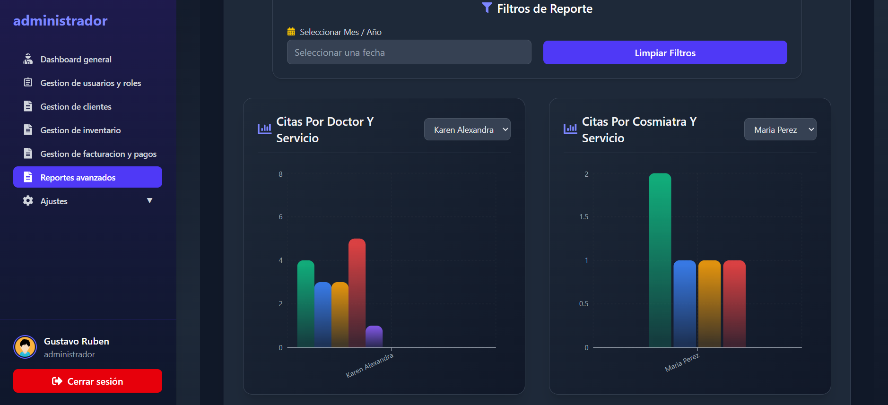

# Web Karito Centro Estetico - ERP para Centros de Estetica

Aplicacion ERP desarrollada para la gestion integral de un centro estetico.
Permite administrar pacientes, citas, tratamientos, inventario, pagos, reportes y usuarios desde una interfaz moderna, responsiva y conectada en tiempo real con el backend.

---

## Captura



---

## Caracteristicas principales

- Gestion de pacientes, usuarios, roles y perfiles.
- Agenda de citas con estados y actualizaciones en tiempo real.
- Registro de tratamientos por doctor o cosmiatra.
- Historial de pacientes con detalle de informacion, observaciones e imagenes.
- Galeria responsive para imagenes de tratamientos en `doctor/historial-de-pacientes`.
- Gestion de inventario, insumos, pagos y reportes.
- Recuperacion de contrasena mediante enlace seguro enviado por correo.
- Interfaz SPA con rutas protegidas y layouts por rol.
- Soporte PWA mediante `vite-plugin-pwa`.

---

## Cambios recientes

### Galeria de tratamientos

En la seccion de historial de pacientes, las imagenes del tratamiento ahora se abren en un modal de galeria:

- Vista de imagen completa con `object-contain` para no recortar el contenido.
- Navegacion anterior/siguiente cuando hay mas de una imagen.
- Soporte de teclado: `Escape`, flecha izquierda y flecha derecha.
- Bloqueo del scroll de fondo mientras el modal esta abierto.
- Uso de miniaturas optimizadas cuando el backend entrega `thumbnailUrl`.

Archivo principal:

```text
src/components/HistorialPacientes/ObservacionesImagenes.jsx
```

### Recuperacion de contrasena

El formulario de nueva contrasena ahora consume un token seguro recibido por URL:

```text
/new-password?token=...
```

Ya no se cambia la contrasena usando solo el correo del usuario.

---

## Tecnologias utilizadas

| Tipo        | Tecnologia                    | Descripcion                       |
| ----------- | ----------------------------- | --------------------------------- |
| Frontend    | React 18 + Vite               | SPA basada en componentes         |
| Estilos     | TailwindCSS 4                 | Diseno responsivo y utilitario    |
| Ruteo       | React Router DOM 7            | Gestion de rutas y layouts        |
| HTTP        | Axios + Fetch                 | Consumo de API REST               |
| Tiempo real | Socket.IO Client              | Actualizaciones en vivo           |
| Graficos    | Recharts                      | Reportes y metricas               |
| UI          | React Icons, React Datepicker | Iconografia y seleccion de fechas |
| PWA         | vite-plugin-pwa               | App instalable y service worker   |
| Calidad     | ESLint                        | Revision de codigo                |

---

## Arquitectura del proyecto

```text
src/
├── api/                 # Clientes HTTP y configuracion de Axios
├── assets/              # Imagenes y recursos estaticos
├── components/          # Componentes reutilizables por modulo
├── context/             # Estado global de citas, tratamientos, pagos y socket
├── hooks/               # Hooks reutilizables
├── layout/              # Layouts y menus por rol
├── pages/               # Pantallas principales del sistema
├── utils/               # Funciones auxiliares
├── App.jsx              # Definicion de rutas
└── main.jsx             # Punto de entrada
```

### Comunicacion con el backend

- API REST en Node.js + Express + MongoDB.
- Autenticacion mediante JWT.
- Actualizaciones en tiempo real mediante Socket.IO.
- Imagenes de tratamientos y avatares almacenadas en Cloudinary desde el backend.

---

## Variables de entorno

Crea un archivo `.env` en la raiz del frontend:

```bash
VITE_API_URL=http://localhost:5000
VITE_SOCKET_URL=http://localhost:5000
```

> `VITE_API_URL` debe apuntar al origen del backend, sin `/api`, porque la aplicacion agrega ese prefijo en las peticiones.

---

## Instalacion y ejecucion

```bash
npm install
npm run dev
```

Por defecto, Vite levanta la app en:

```text
http://localhost:5173
```

Build de produccion:

```bash
npm run build
```

Previsualizar build:

```bash
npm run preview
```

---

## Scripts disponibles

| Comando           | Descripcion                         |
| ----------------- | ----------------------------------- |
| `npm run dev`     | Inicia el servidor de desarrollo    |
| `npm run build`   | Compila el proyecto para produccion |
| `npm run preview` | Sirve el build localmente           |
| `npm run lint`    | Ejecuta ESLint                      |

---

## Dependencias clave

```json
{
  "react": "^18.3.1",
  "vite": "npm:rolldown-vite@7.1.12",
  "tailwindcss": "^4.1.13",
  "axios": "^1.12.2",
  "react-router-dom": "^7.9.3",
  "socket.io-client": "^4.8.1",
  "recharts": "^3.2.1"
}
```

---

## Notas de calidad

- El build de produccion se valida con `npm run build`.
- La galeria de imagenes soporta escritorio y movil.
- Si `npm run lint` falla por archivos generados en `dev-dist`, revisa primero si deben excluirse del lint antes de corregir codigo de aplicacion.

---

## Proximas mejoras

- Documentar flujos de usuario por rol.
- Separar chunks grandes con `dynamic import`.
- Agregar pruebas automatizadas para rutas criticas.
- Integracion con facturacion electronica.
- Despliegue con Docker + CI/CD.

---

## Licencia

Proyecto bajo licencia MIT.
