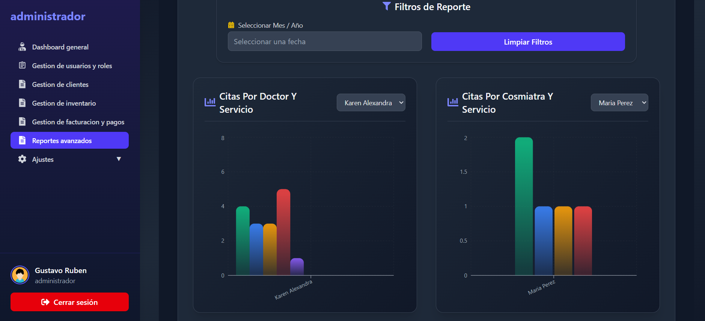

# 🏥 Karito Centro Estético — Sistema Web de Gestión Administrativa

> **Diseño e Implementación de un Sistema Web de Gestión Administrativa para Citas, Servicios, Facturación e Inventarios en el Centro Estético Karito, utilizando la Arquitectura Cliente-Servidor con las Tecnologías MERN (MongoDB, Express, React y Node.js).**

Sistema ERP desarrollado para la gestión integral de un centro estético. Permite administrar pacientes, citas, tratamientos, inventario, pagos, reportes y usuarios desde una interfaz moderna, responsiva y conectada en tiempo real.

---

## 📸 Vista Previa



---

## ✨ Características Principales

- **Gestión de citas** con estados y actualizaciones en tiempo real vía WebSocket.
- **Registro de tratamientos** con carga de imágenes (Cloudinary) y descuento automático de insumos.
- **Historial de pacientes** con galería responsive, navegación por teclado y miniaturas optimizadas.
- **Gestión de inventario** con alertas de stock bajo y filtrado por rol.
- **Facturación y pagos** con generación de tickets en PDF y reportes por método de pago.
- **Dashboard analítico** con gráficos interactivos (Recharts) de ingresos, citas y servicios.
- **Gestión de usuarios y roles** con activación/suspensión y eliminación segura.
- **Recuperación de contraseña** mediante enlace seguro con token enviado por correo.
- **Interfaz SPA** con rutas protegidas y layouts diferenciados por rol.
- **Soporte PWA** — aplicación instalable con Service Worker.
- **Modo offline** con alerta visual de desconexión.

---

## 🛠️ Stack Tecnológico

### Frontend (este repositorio)

| Categoría | Tecnología | Versión | Propósito |
|-----------|-----------|---------|-----------|
| **Core** | React | 18.3 | Biblioteca de UI basada en componentes |
| **Bundler** | Vite (Rolldown) | 7.1.12 | Build tool ultra-rápido |
| **Estilos** | TailwindCSS | 4.1 | Sistema de diseño utilitario responsivo |
| **Ruteo** | React Router DOM | 7.9 | Navegación SPA con rutas protegidas |
| **HTTP** | Axios | 1.12 | Cliente HTTP con interceptores |
| **Tiempo real** | Socket.IO Client | 4.8 | Comunicación bidireccional WebSocket |
| **Gráficos** | Recharts | 3.2 | Visualización de datos y métricas |
| **UI** | React Icons | 5.5 | Iconografía (FontAwesome, etc.) |
| **Fechas** | Day.js + React Datepicker | — | Manipulación y selección de fechas |
| **Exportación** | XLSX + html2pdf.js | — | Generación de Excel y PDF |
| **PWA** | vite-plugin-pwa | 1.1 | Service Worker y manifiesto |
| **Calidad** | ESLint | 9.36 | Análisis estático de código |

### Backend (repositorio separado)

| Tecnología | Propósito |
|-----------|-----------|
| **Node.js + Express** | API REST |
| **MongoDB + Mongoose** | Base de datos NoSQL |
| **JWT** | Autenticación stateless |
| **Socket.IO** | Eventos en tiempo real |
| **Cloudinary** | Almacenamiento de imágenes |
| **Nodemailer** | Envío de correos (reset de contraseña) |

---

## 🏗️ Arquitectura del Proyecto

### Arquitectura General — Cliente-Servidor

```
┌─────────────────────────────────────────────────┐
│                   CLIENTE (SPA)                  │
│                                                  │
│  React + Vite + TailwindCSS                      │
│  ┌──────────────────────────────────────────┐    │
│  │  Capa de Presentación (Pages/Components) │    │
│  ├──────────────────────────────────────────┤    │
│  │  Capa de Estado (Context + Hooks)        │    │
│  ├──────────────────────────────────────────┤    │
│  │  Capa de Servicios (API Modules)         │    │
│  └────────────┬──────────────┬──────────────┘    │
│               │              │                   │
└───────────────┼──────────────┼───────────────────┘
           HTTP/REST      WebSocket
                │              │
┌───────────────┼──────────────┼───────────────────┐
│               ▼              ▼                   │
│  ┌──────────────────────────────────────────┐    │
│  │  Express API + Socket.IO Server          │    │
│  ├──────────────────────────────────────────┤    │
│  │  Mongoose ODM                            │    │
│  ├──────────────────────────────────────────┤    │
│  │  MongoDB Atlas                           │    │
│  └──────────────────────────────────────────┘    │
│                   SERVIDOR                       │
└──────────────────────────────────────────────────┘
```

### Estructura de Directorios

```
src/
├── api/                    # 🔌 Capa de servicios — módulos API por dominio
│   ├── axiosConfig.js      #    Instancia Axios con interceptor de autenticación
│   ├── auth.api.js          #    Login, registro, reset y cambio de contraseña
│   ├── citas.api.js         #    CRUD de citas + búsqueda + profesionales
│   ├── inventario.api.js    #    Gestión de insumos y servicios por rol
│   ├── pagos.api.js         #    Consulta y registro de pagos
│   ├── tratamientos.api.js  #    Consulta y registro de tratamientos
│   └── user.api.js          #    Gestión de usuarios (CRUD + suspensión)
│
├── context/                # 🌐 Estado global
│   └── CitasContext.jsx     #    Provider central: citas, tratamientos, pagos, socket
│
├── hooks/                  # 🪝 Hooks personalizados reutilizables
│   ├── useAuth.js           #    Lectura memoizada de usuario/token desde localStorage
│   ├── useModal.js          #    Gestión de estado de modales (show/message/type)
│   └── useUsuarios.js       #    Lógica completa de CRUD de usuarios
│
├── utils/                  # 🧰 Funciones puras auxiliares
│   ├── citasFecha.js        #    Conversión y formateo de fechas de citas
│   └── validators.js        #    Validadores centralizados (email, nombre, rol)
│
├── layout/                 # 📐 Layouts y navegación
│   ├── DashboardLayout.jsx  #    Layout genérico parametrizado (Template Method)
│   ├── AdminLayout.jsx      #    Configuración del layout para Administrador
│   ├── CosmiatraLayout.jsx  #    Configuración del layout para Cosmiatra
│   ├── DoctorLayout.jsx     #    Configuración del layout para Doctor
│   ├── NavbarFooterLayout.jsx #  Layout público (Home, Login, Reset)
│   ├── MenuItemsAdmin.jsx   #    Definición de menú del Administrador
│   ├── MenuItemsCosmiatra.jsx #  Definición de menú de Cosmiatra
│   └── MenuItemsDoctor.jsx  #    Definición de menú del Doctor
│
├── pages/                  # 📄 Pantallas del sistema (por rol)
│   ├── admin/               #    Dashboard, Usuarios, Clientes, Inventario, Facturación, Reportes
│   ├── auth/                #    Login, ResetPassword, NewPassword
│   ├── cosmiatra/           #    Citas, Pagos, Reportes de servicios
│   ├── doctor/              #    Agenda, Historial, Tratamientos, Reportes
│   └── settings/            #    Perfil, Contraseña (compartido entre roles)
│
├── components/             # 🧩 Componentes UI reutilizables (~65 componentes)
│   ├── common/              #    AuthPageLayout, ProtectedRoute, LoadingSpinner, Skeleton, etc.
│   ├── AgendaCitas/         #    CitaForm, CitaTable
│   ├── CitaForm/            #    FormInput, FormSelect, FormDateTime, ServiceSelector
│   ├── DashboardDoctor/     #    Gráficos y filtros de reportes
│   ├── DashboardGeneral/    #    Resumen, ingresos, métodos de pago, inventario
│   ├── GestionClientes/     #    Buscador, cards, detalle, exportación Excel
│   ├── GestionInventario/   #    Formularios, tablas, modal de edición
│   ├── GestionPagos/        #    Buscador, tabla, modal de pago, ticket
│   ├── GestionUsuariosRoles/#    Formulario, tabla, modales de confirmación
│   ├── HistorialPacientes/  #    Buscador, lista, detalle, galería de imágenes
│   ├── Home/                #    Landing page pública
│   ├── Login/               #    Formulario de login
│   ├── Perfil/              #    Avatar, formulario, modal de confirmación
│   ├── RegistaTratamiento/  #    Campos de formulario, uploader de imágenes
│   ├── ReportesAvanzados/   #    Gráficos comparativos
│   ├── ReportesServiciosIngresos/ # Historial, tabla de servicios
│   ├── Sidebar/             #    Navegación lateral responsive
│   ├── Topbar/              #    Barra superior con breadcrumb
│   └── ...                  #    Footer, Navbar, Logo, OfflineAlert, etc.
│
├── assets/                 # 🖼️ Recursos estáticos (logo, imágenes)
├── App.jsx                 # 🚀 Definición de rutas de la aplicación
├── main.jsx                # 📍 Punto de entrada (render + CitasProvider)
└── index.css               # 🎨 Estilos globales y sistema de diseño
```

---

## 🔄 Flujo de Datos

```
                    ┌─────────────┐
                    │  Socket.IO  │ ◄── Eventos en tiempo real
                    │   Server    │     (nuevaCita, estadoCitaActualizado,
                    └──────┬──────┘      nuevoPago, inventarioActualizado,
                           │              tratamientoActualizado)
                           ▼
┌──────────────────────────────────────────────┐
│              CitasContext (Provider)          │
│  ┌─────────┐ ┌──────────┐ ┌───────┐         │
│  │  Citas  │ │Tratamient│ │ Pagos │  Socket  │
│  └────┬────┘ └─────┬────┘ └───┬───┘    ref   │
│       │            │          │               │
│  Funciones: obtenerCitas(), registrarCita(),  │
│  obtenerTratamientos(), obtenerPagos(), etc.  │
└──────────────┬───────────────────────────────┘
               │ useCitas()
               ▼
┌──────────────────────────────────────────────┐
│           Pages (Pantallas)                   │
│                                              │
│  useAuth()  → { user, token, rol, nombre }   │
│  useModal() → { modal, mostrarModal }        │
│                                              │
│  ┌────────────────────────────────────────┐  │
│  │         Components (UI pura)           │  │
│  │  Props ↓          Callbacks ↑          │  │
│  └────────────────────────────────────────┘  │
└──────────────────────────────────────────────┘
               │
               ▼ API Modules (api/*.js)
┌──────────────────────────────────────────────┐
│            axiosConfig.js                     │
│  ┌────────────────────────────────────────┐  │
│  │  Interceptor: inyecta Authorization    │  │
│  │  header automáticamente en cada        │  │
│  │  request usando localStorage token     │  │
│  └────────────────────────────────────────┘  │
│         baseURL: VITE_API_URL/api            │
└──────────────────────────────────────────────┘
               │
               ▼ HTTP (REST)
         Backend Express
```

---

## 🎯 Principios de Código Limpio Aplicados

### DRY (Don't Repeat Yourself)

| Problema original | Solución |
|-------------------|----------|
| `localStorage.getItem("token")` repetido 30+ veces en pages y hooks | **Hook `useAuth`** centraliza la lectura del usuario y token con memoización |
| Patrón `showModal/modalMessage/modalType` duplicado en ~8 archivos | **Hook `useModal`** encapsula todo el estado del modal en una sola llamada |
| Regex de email duplicada en Login, ResetPassword y useUsuarios | **`validators.js`** centraliza `isValidEmail`, `isValidName`, `isValidRole` |
| 3 layouts (Admin, Doctor, Cosmiatra) con ~90% código idéntico | **`DashboardLayout`** genérico parametrizado reduce cada layout a configuración |
| Shell visual de auth repetido en Login, ResetPassword y NewPassword | **`AuthPageLayout`** componente reutilizable con slots para contenido |
| Llamadas API dispersas con URLs hardcoded | **Módulos API** por dominio (`citas.api.js`, `pagos.api.js`, etc.) |

### SRP (Single Responsibility Principle)

Cada capa tiene una responsabilidad única:

```
api/           → Solo comunicación HTTP (sin lógica de UI ni estado)
hooks/         → Solo lógica de estado reutilizable (sin renderizado)
context/       → Solo estado global compartido (sin lógica de negocio pesada)
pages/         → Orquestación (conecta hooks, API y componentes)
components/    → Solo renderizado UI (reciben datos por props)
utils/         → Solo funciones puras (sin side effects)
```

### KISS (Keep It Simple, Stupid)

- Los layouts pasaron de ~105 líneas de lógica imperativa a ~40 líneas de configuración declarativa.
- Los módulos API exponen funciones simples de una línea: `export const getCitas = async () => { const { data } = await API.get("/citas"); return data; }`.
- Los validadores son funciones puras sin estado: `export const isValidEmail = (email) => EMAIL_REGEX.test(email.trim())`.

### OCP (Open/Closed Principle)

- **`DashboardLayout`** está abierto a extensión (agregar un nuevo rol solo requiere crear un nuevo archivo de configuración) y cerrado a modificación (no necesita tocar el layout base).

### Clean Code

- Eliminación de **código muerto**: 3 archivos `RenderContent*.jsx` que no se importaban desde ningún lado.
- Eliminación de **estado muerto**: `isAuthenticated` en `App.jsx` que se definía pero nunca se leía.
- Reconstrucción de `citas.api.js` que contenía un bloque `fetch` suelto sin exportación.

---

## 🎨 Patrones de Diseño Implementados

### 1. Template Method — `DashboardLayout`

El layout genérico define la **estructura fija** (sidebar + overlay + topbar + routes), mientras cada layout específico inyecta la **configuración variable** (rutas, menú, base path).

```jsx
// DashboardLayout.jsx — Template (estructura fija)
export default function DashboardLayout({ basePath, menuItems, routes, routeMap }) {
  // Sidebar + Topbar + Routes → estructura compartida
}

// AdminLayout.jsx — Configuración concreta
const ROUTES = [
  { path: "dashboard-general", element: DashboardGeneral },
  { path: "gestion-de-usuarios-y-roles", element: GestionUsuariosRoles },
  // ...
];

export default function AdminLayout() {
  return <DashboardLayout basePath="/administrador" routes={ROUTES} /* ... */ />;
}
```

### 2. Facade — `useModal`

Encapsula la complejidad de gestionar 3 estados interdependientes (`show`, `message`, `type`) detrás de una interfaz simple:

```jsx
// Antes: 4 variables de estado + función manual en cada archivo
const [showModal, setShowModal] = useState(false);
const [modalMessage, setModalMessage] = useState("");
const [modalType, setModalType] = useState("info");

// Después: una sola línea
const { modal, mostrarModal, cerrarModal } = useModal();
mostrarModal("✅ Operación exitosa");       // Abre el modal
mostrarModal("❌ Error occurred", "error");  // Con tipo
cerrarModal();                               // Cierra
```

### 3. Provider Pattern — `CitasContext`

Centraliza el estado global compartido (citas, tratamientos, pagos, socket) y lo distribuye a cualquier componente del árbol vía `useCitas()`:

```jsx
// main.jsx
<CitasProvider>
  <App />
</CitasProvider>

// Cualquier componente del árbol
const { citas, obtenerCitas, socket } = useCitas();
```

### 4. Interceptor Pattern — `axiosConfig`

Un interceptor de request inyecta automáticamente el token JWT en **todas** las peticiones HTTP, eliminando la necesidad de pasar el token manualmente en cada llamada:

```jsx
// axiosConfig.js
API.interceptors.request.use((config) => {
  const token = localStorage.getItem("token");
  if (token) config.headers.Authorization = `Bearer ${token}`;
  return config;
});

// Uso: sin token manual
export const getCitas = async () => {
  const { data } = await API.get("/citas");  // Token se inyecta automáticamente
  return data;
};
```

### 5. Composition Pattern — `AuthPageLayout`

Las páginas de autenticación componen su contenido dentro de un shell visual reutilizable usando el patrón de `children`:

```jsx
<AuthPageLayout
  title="Control interno..."
  highlights={HIGHLIGHTS}
  cardTitle="Ingresar"
>
  <LoginForm />    {/* ← Contenido específico */}
</AuthPageLayout>
```

### 6. Module Pattern — Capa API

Cada dominio de negocio tiene su propio módulo API que exporta funciones independientes:

```
api/
├── citas.api.js         → getCitas, registrarCita, actualizarCita, eliminarCita, ...
├── pagos.api.js         → getPagos, registrarPago
├── tratamientos.api.js  → getTratamientos, registrarTratamiento, buscarPaciente
├── inventario.api.js    → getInventario, agregarItem, eliminarItem, ...
└── user.api.js          → getAllUsers, registerUserByAdmin, suspenderUsuario, ...
```

---

## 🔐 Sistema de Autenticación y Roles

### Flujo de Autenticación

```
1. Usuario envía email + password → POST /api/auth/login
2. Backend valida credenciales → Retorna { token (JWT), user }
3. Frontend almacena en localStorage → token + user
4. Axios interceptor inyecta token en cada request
5. ProtectedRoute verifica token antes de renderizar rutas privadas
6. DashboardLayout renderiza el layout según el rol del usuario
```

### Roles y Permisos

| Rol | Ruta base | Módulos accesibles |
|-----|-----------|-------------------|
| **Administrador** | `/administrador` | Dashboard general, Usuarios, Clientes, Inventario, Facturación, Reportes avanzados |
| **Doctor** | `/doctor` | Agenda de citas, Historial de pacientes, Registrar tratamiento, Mis reportes |
| **Cosmiatra** | `/cosmiatra` | Gestión de citas, Registrar tratamiento, Pagos, Historial, Reportes de servicios |

### Protección de Rutas

```jsx
// ProtectedRoute.jsx — Wrapper de autenticación
export default function ProtectedRoute() {
  const token = localStorage.getItem("token");
  if (!token) return <Navigate to="/login" replace />;
  return <Outlet />;
}

// App.jsx — Rutas protegidas anidadas
<Route element={<ProtectedRoute />}>
  <Route path="/administrador/*" element={<AdminLayout />} />
  <Route path="/doctor/*"        element={<DoctorLayout />} />
  <Route path="/cosmiatra/*"     element={<CosmeatraRecepcionistaLayout />} />
</Route>
```

---

## ⚡ Comunicación en Tiempo Real

El sistema utiliza **Socket.IO** para mantener sincronizados a todos los usuarios conectados:

| Evento | Emisor | Efecto en el cliente |
|--------|--------|---------------------|
| `nuevaCita` | Backend al crear cita | Agrega la cita a la lista + muestra notificación |
| `estadoCitaActualizado` | Backend al cambiar estado | Actualiza el estado de la cita en la tabla |
| `citaActualizada` | Backend al editar cita | Reemplaza los datos de la cita editada |
| `citaEliminada` | Backend al eliminar | Remueve la cita de la lista |
| `nuevoPago` | Backend al registrar pago | Agrega el pago + notifica al usuario |
| `tratamientoActualizado` | Backend al registrar tratamiento | Recarga la lista de tratamientos |
| `inventarioActualizado` | Backend al modificar stock | Actualiza la tabla de inventario |

---

## 📊 Métricas del Proyecto

| Métrica | Valor |
|---------|-------|
| **Archivos fuente** | ~142 (JSX, JS, CSS) |
| **Componentes UI** | ~65 componentes reutilizables |
| **Páginas** | 18 pantallas distribuidas en 4 módulos |
| **Módulos API** | 7 módulos centralizados |
| **Hooks personalizados** | 3 (`useAuth`, `useModal`, `useUsuarios`) |
| **Funciones de utilidad** | 2 módulos (`citasFecha`, `validators`) |
| **Layouts** | 1 genérico + 3 configuraciones por rol + 1 público |

---

## ⚙️ Variables de Entorno

Crea un archivo `.env` en la raíz del frontend:

```bash
VITE_API_URL=http://localhost:5000
VITE_SOCKET_URL=http://localhost:5000
```

> `VITE_API_URL` debe apuntar al origen del backend **sin** `/api`, porque la aplicación agrega ese prefijo en las peticiones a través de `axiosConfig.js`.

---

## 🚀 Instalación y Ejecución

### Requisitos previos

- **Node.js** ≥ 18
- **npm** ≥ 9
- Backend corriendo en el puerto configurado en `.env`

### Instalación

```bash
git clone <url-del-repositorio>
cd Web_Estetico
npm install
```

### Desarrollo

```bash
npm run dev
```

La aplicación estará disponible en `http://localhost:5173`.

### Producción

```bash
npm run build       # Compila para producción
npm run preview     # Sirve el build localmente
```

### Scripts Disponibles

| Comando | Descripción |
|---------|-------------|
| `npm run dev` | Inicia el servidor de desarrollo con HMR |
| `npm run build` | Compila el proyecto para producción |
| `npm run preview` | Sirve el build localmente para pruebas |
| `npm run lint` | Ejecuta ESLint para análisis estático |

---

## 📋 Dependencias

### Producción

```json
{
  "react": "^18.3.1",
  "react-dom": "^18.3.1",
  "react-router-dom": "^7.9.3",
  "axios": "^1.12.2",
  "socket.io-client": "^4.8.1",
  "recharts": "^3.2.1",
  "tailwindcss": "^4.1.13",
  "react-icons": "^5.5.0",
  "react-datepicker": "^8.8.0",
  "react-modal": "^3.16.3",
  "dayjs": "^1.11.19",
  "xlsx": "^0.18.5",
  "html2pdf.js": "^0.12.1",
  "vite-plugin-pwa": "^1.1.0"
}
```

### Desarrollo

```json
{
  "vite": "npm:rolldown-vite@7.1.12",
  "eslint": "^9.36.0",
  "@vitejs/plugin-react-swc": "^4.1.0"
}
```

---

## 🗂️ Cambios Recientes

### Refactorización de Código (Agosto 2026)

Se realizó una refactorización completa del frontend aplicando principios de ingeniería de software:

- **Capa API unificada** — 7 módulos con interceptor automático de autenticación.
- **Hooks reutilizables** — `useAuth`, `useModal`, `useUsuarios` eliminan 30+ repeticiones.
- **Layout genérico** — Patrón Template Method reduce 3 layouts a configuración declarativa.
- **Auth visual unificado** — `AuthPageLayout` elimina ~240 líneas de JSX duplicado.
- **Eliminación de código muerto** — 3 archivos `RenderContent*` + estado `isAuthenticated` sin uso.
- **Validadores centralizados** — `validators.js` unifica regex dispersas.

### Galería de Tratamientos

En la sección de historial de pacientes, las imágenes del tratamiento se abren en un modal de galería con navegación por teclado, bloqueo de scroll, y soporte de miniaturas optimizadas.

### Recuperación de Contraseña

El formulario de nueva contraseña consume un token seguro recibido por URL: `/new-password?token=...`.

---

## 🔮 Próximas Mejoras

- [ ] Separar chunks grandes con `dynamic import()` para optimizar carga inicial.
- [ ] Agregar pruebas automatizadas (Vitest + React Testing Library).
- [ ] Centralizar gestión de Socket.IO en un Provider/Hook dedicado.
- [ ] Integración con facturación electrónica.
- [ ] Despliegue con Docker + CI/CD.
- [ ] Documentar flujos de usuario por rol.

---

## 📄 Licencia

Proyecto bajo licencia MIT.
